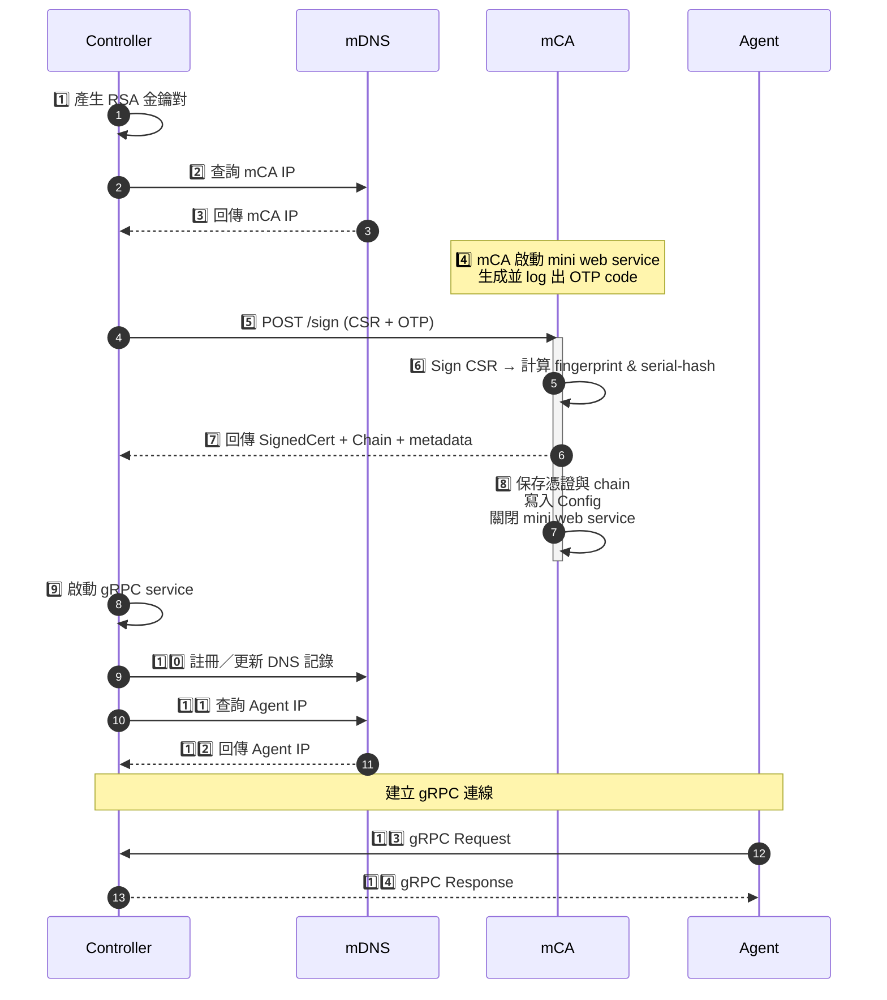

```mermaid
sequenceDiagram
  autonumber
  participant C as Controller
  participant D as mDNS
  participant M as mCA
  participant A as Agent

  C->>C: 1️⃣ 產生 RSA 金鑰對

  C->>D: 2️⃣ 查詢 mCA IP  
  D-->>C: 3️⃣ 回傳 mCA IP

  Note over M: 4️⃣ mCA 啟動 mini web service<br>生成並 log 出 OTP code

  C->>M: 5️⃣ POST /sign (CSR + OTP)
  activate M
  M->>M: 6️⃣ Sign CSR → 計算 fingerprint & serial‑hash  
  M-->>C: 7️⃣ 回傳 SignedCert + Chain + metadata  
  M->>M: 8️⃣ 保存憑證與 chain<br>寫入 Config<br>關閉 mini web service
  deactivate M

  C->>C: 9️⃣ 啟動 gRPC service

  C->>D: 1️⃣0️⃣ 註冊／更新 DNS 記錄

  C->>D: 1️⃣1️⃣ 查詢 Agent IP  
  D-->>C: 1️⃣2️⃣ 回傳 Agent IP

  Note over A,C: 建立 gRPC 連線  
  A->>C: 1️⃣3️⃣ gRPC Request  
  C-->>A: 1️⃣4️⃣ gRPC Response
```
