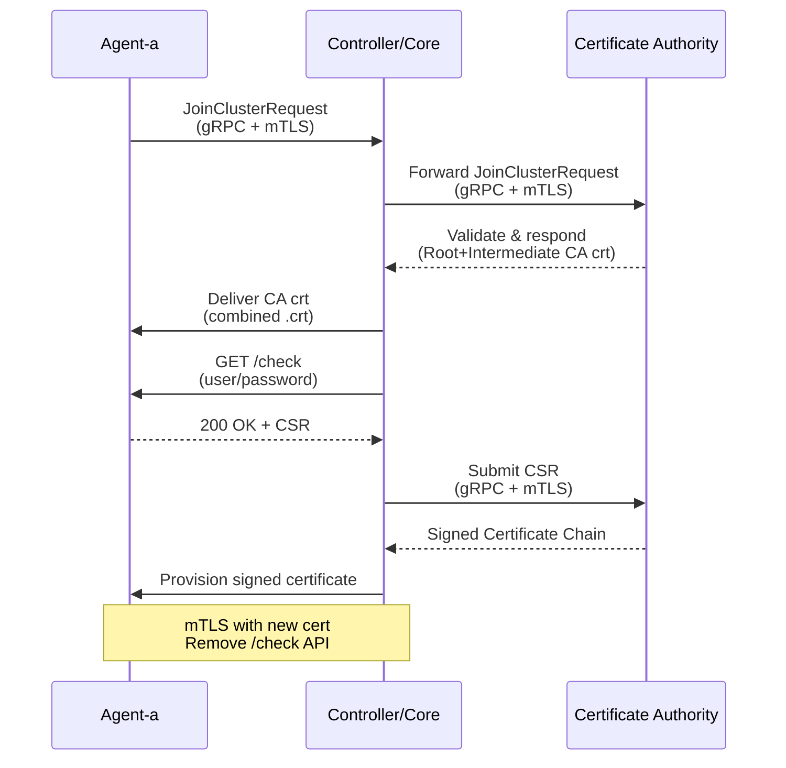

## 技術棧
### 主要
- React： 用於繪製UI及向後端請求資料
- Rust： 後端服務器，處理邏輯問題
### 次要
#### 前端
- `TailWindcss`：Css 框架，避免手寫Css
- `module-federation`(模組聯邦)：將每個模組單獨編譯之後透過載入程式讀入主程式中，主程式已經完成編譯
- `Vite`：React 好用的打包工具
- `Pnpm`：前端套件管理
- `Lua`：一種輕量級程式語言，編寫模組後端邏輯
- `TypeScript`：帶有語法及型別檢查
#### 後端
- `actix-cors`：處理及配置Cors
- `actix-files`：處理靜態檔案
- `actix-web`：Web Server
- `mlua`：Lua 處理的函式庫
- `semver`：解析軟體版本
- `serde`：序列化及反序列化
- `serde_json`：用來處理Json格式
- `zip`：操作壓縮檔
## CHM系統內相關
### 前端
- `Dashboard`：監控電腦狀態
	- `CPU/ Memory`：系統內所有主機加總CPU/ Memory
	- `Disk`：所有主機的磁碟容量 
### User 
- `CHM - User & Group`：管理使用者帳號與群組。可新增、刪除或修改使用者資訊，設定使用者所屬群組，以利權限控管與資源存取
- `CHM - Roles`：可以將對本系統(CHM)的不同操作權限（例如查詢、新增、修改、刪除）賦予給指定身份，並將身份套用到選擇的使用者(user)
### System
- `CHM - Backup`：立即備份系統設定，或還原備份
- `CHM - Settings`：提供系統整體設定功能
- `Logs`：系統/ 主機 Logs管理  
### Host
- `CHM - Add/Remove PC`：新增/刪除主機到系統
- `CHM - PC Group`：電腦群組管理
	切割group可避免網路廣播風暴，也可以避免群體中毒，假設A group 裡有電腦中毒，只有A group 裡的電腦可能中毒，B group 不會受到干擾， 2個group不能互相通訊 (資安問題)
- `Process Manager & System Shutdown`：電腦程序管理
- `Cron Management`：管理排程任務
- `Software Package`：管理安裝於主機上的軟體套件，可進行安裝、移除
- `File Upload & Download`：從系統上傳/ 下載檔案到指定主機
- `Servers`：伺服器管理
- `Firewall`：防火牆管理
- `Network Configuration`：用於管理網路設定，包括Network Interface 、Routing and Gateways 、 Hostname and DNS Client，新增、修改、啟用/關閉等操作

### 後端
- `系統`：指我們自己CHM系統  
- `作業系統、OS`：指Linux主機
- `Agent_device`：安裝`CHMad`的實體主機
- `Controller_device`：安裝`CHMcd`的實體主機
- `CHMad`：系統裡的agent軟體
- `CHMahd`：Agent內接收`CHMad`轉換之後的指令並且執行
- `CHMcd`：系統內的controller軟體
- `HAProxy`：用來當作負載均衡器
- `Caddy`：前端Web服務器
- `API`：指前後端溝通的介面
- `gRPC`：後端內部溝通協議
- `CHM_mDHCPd`：DHCP的變形版本，提供gRPC及分配IP位置
- `CHM_mDNSd`：DNS的變形版本，提供gRPC及UUID、IP、Hostname轉換
- `CHM_mCAd`：CA的變形版本，提供gRPC簽署憑證功能
- `LDAP_Bind`：Rust中與實際LDAP的綁定庫，並添加實用函數及gRPC
- `Base_Service`：系統中提供基礎服務的切片(Slice)
- `Slice`：系統之後的擴展點位
- `mTLS`：憑證雙向驗證
- `zone`：對應前端Pc Groups

