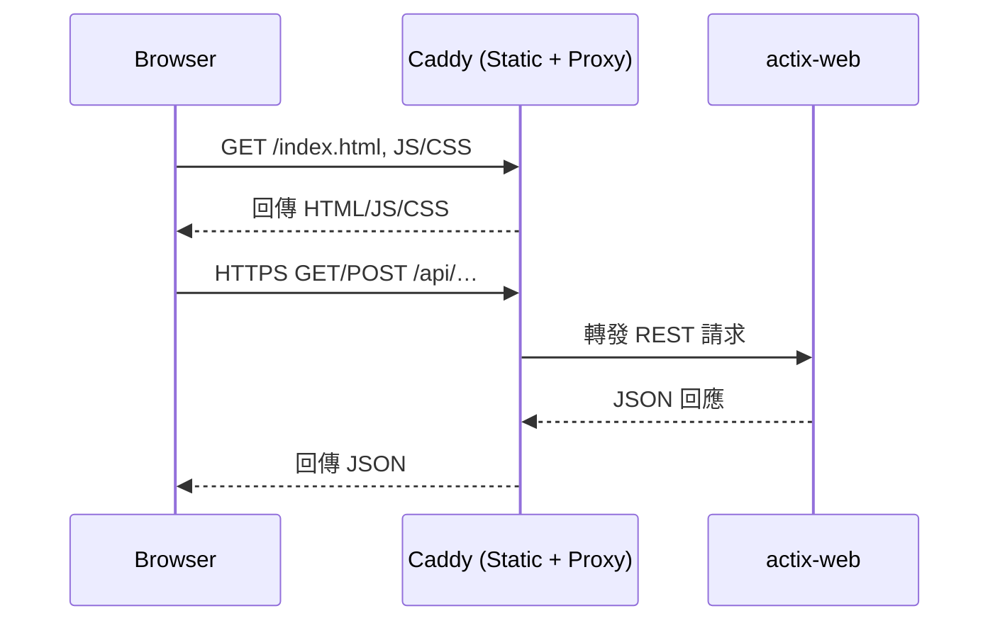
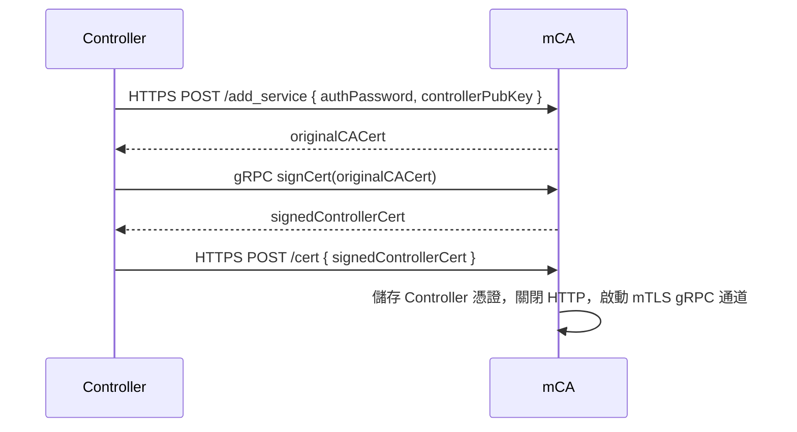
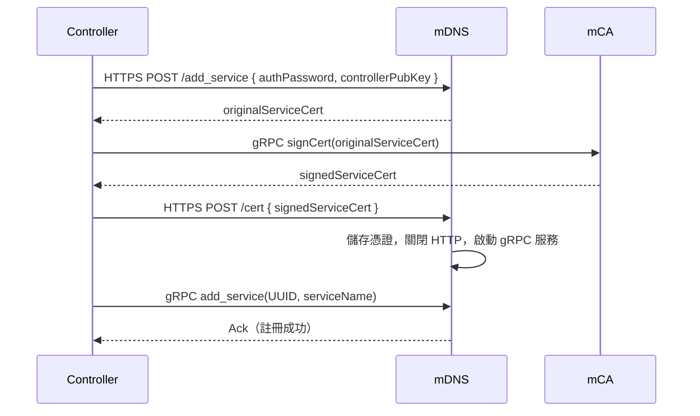
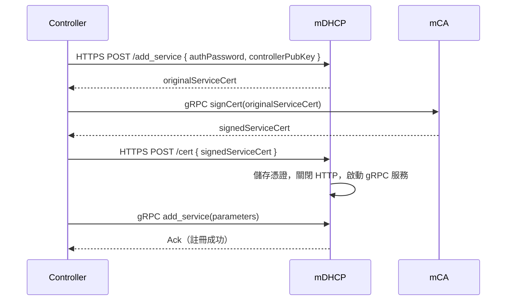
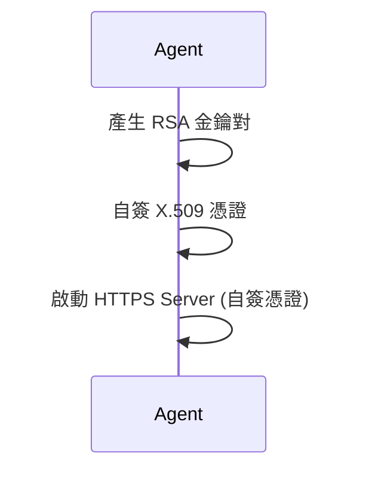
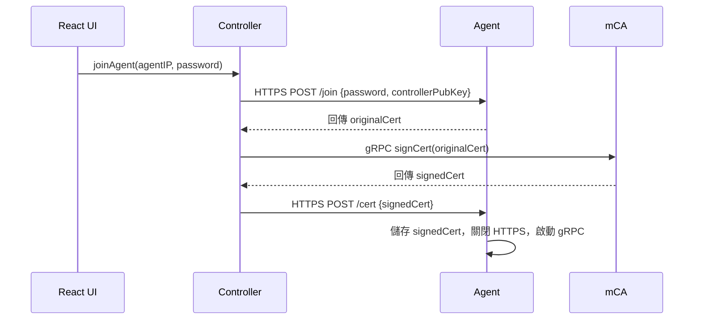
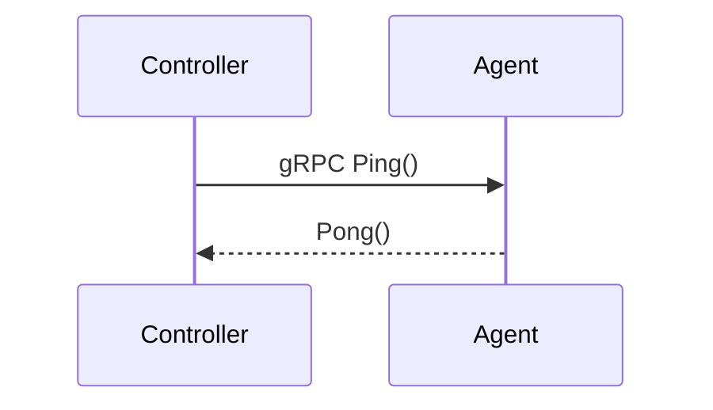
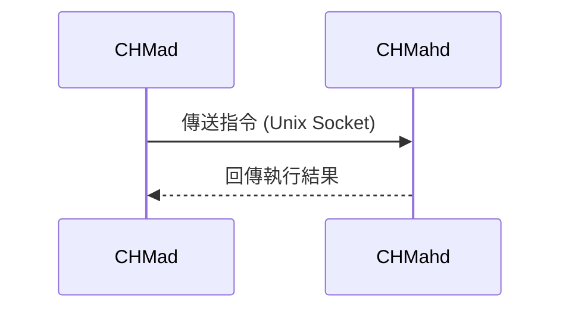

# 系統傳圖
## 前端（React）與後端（Actix-Web）透過 RESTful API 通信

## mCA 與 Controller 的初始 gRPC 憑證簽署（mCA 扮演小型 Controller）

##  Controller 與 mDNS 服務的 gRPC 註冊

## Controller 與 mDHCP 服務的 gRPC 註冊

## Agent 本地安裝：生成自簽 X.509 憑證並啟動 HTTPS Server

## Controller 與 Agent 的首次連線與憑證交換

## Controller 對 Agent 的 gRPC 健康檢查（Ping/Pong）

## CHMad（Agent 進程）與 CHMahd（執行端程式）之間的 Linux Socket 通信
